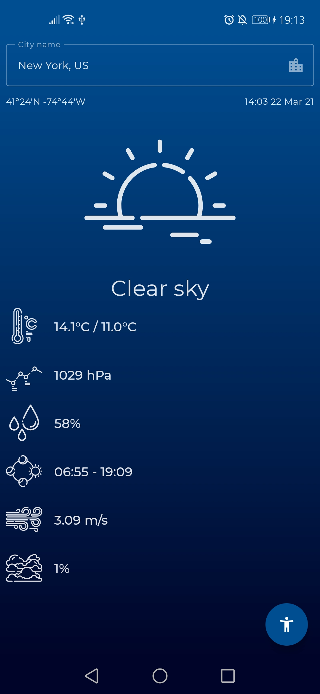
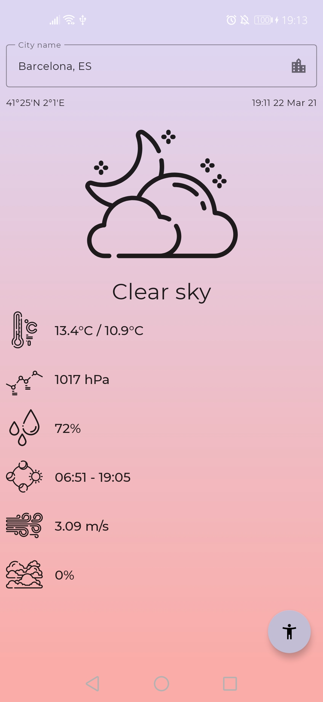
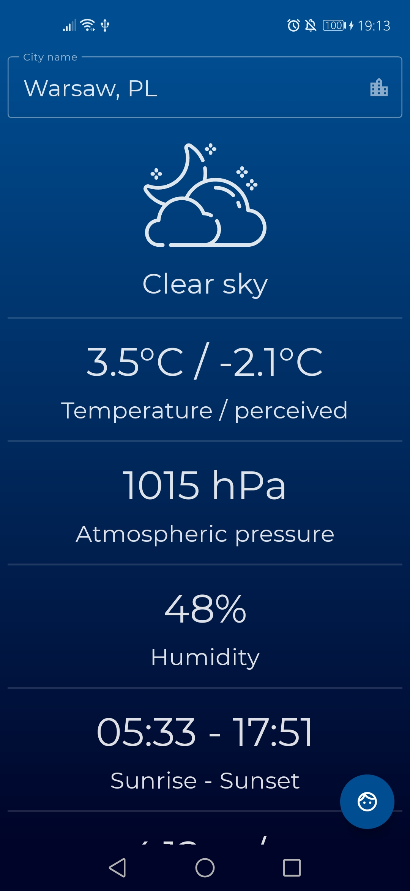
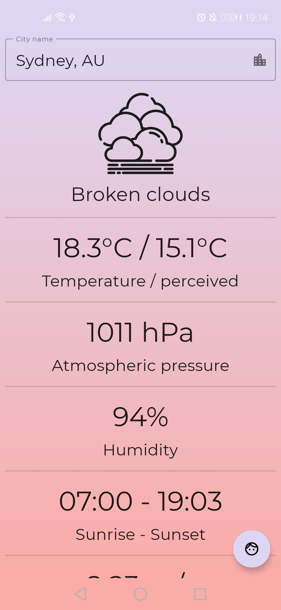

# WeatherApp
A simple app, written in Jetpack-Compose that displays current weather based on Open Weather API. The app has a mode for elderly people

## Normal mode (light and dark theme):

</img>

</img>

## Suppoert for elderly people (light and dark theme):

</img>

</img>

## App demo:

</img>
